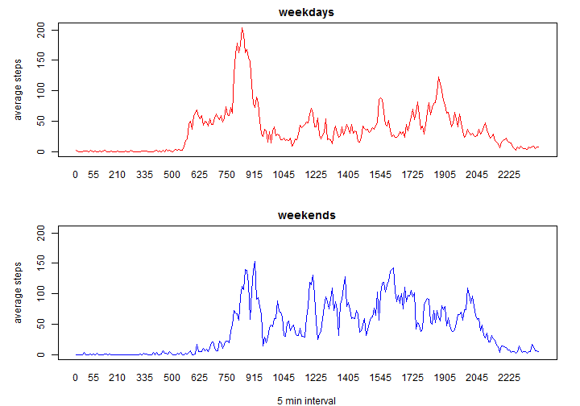

# Reproducible Research: Peer Assessment 1
# set locale : English

```r
Sys.setlocale("LC_TIME","English")
```

```
## [1] "English_United States.1252"
```

## Loading and preprocessing the data

```r
# Load the data (i.e. read.csv())
data <- read.csv("activity.csv", 
                 stringsAsFactors=FALSE)
# Process/transform column(date) into date format suitable for analysis
data$date <- as.Date(data$date, "%Y-%m-%d")
```

## What is mean total number of steps taken per day?

```r
# Make a histogram of the total number of steps taken each day
x <- tapply(data$steps,data$date,sum)
hist(x,main="Histogram of the total number of steps per day",
     xlab="steps")
```

 

```r
#plot(x,type="l")
#plot(data$steps,type="l")
# Calculate and report the mean and median total number of steps taken per day
s_mean <- cbind(tapply(data$steps,data$date,mean,na.rm=TRUE))
colnames(s_mean) <- c("steps")
#s1_mean <- mean(s_mean,na.rm = TRUE)
#s1_mean
s_mean
```

```
##              steps
## 2012-10-01     NaN
## 2012-10-02  0.4375
## 2012-10-03 39.4167
## 2012-10-04 42.0694
## 2012-10-05 46.1597
## 2012-10-06 53.5417
## 2012-10-07 38.2465
## 2012-10-08     NaN
## 2012-10-09 44.4826
## 2012-10-10 34.3750
## 2012-10-11 35.7778
## 2012-10-12 60.3542
## 2012-10-13 43.1458
## 2012-10-14 52.4236
## 2012-10-15 35.2049
## 2012-10-16 52.3750
## 2012-10-17 46.7083
## 2012-10-18 34.9167
## 2012-10-19 41.0729
## 2012-10-20 36.0938
## 2012-10-21 30.6285
## 2012-10-22 46.7361
## 2012-10-23 30.9653
## 2012-10-24 29.0104
## 2012-10-25  8.6528
## 2012-10-26 23.5347
## 2012-10-27 35.1354
## 2012-10-28 39.7847
## 2012-10-29 17.4236
## 2012-10-30 34.0938
## 2012-10-31 53.5208
## 2012-11-01     NaN
## 2012-11-02 36.8056
## 2012-11-03 36.7049
## 2012-11-04     NaN
## 2012-11-05 36.2465
## 2012-11-06 28.9375
## 2012-11-07 44.7326
## 2012-11-08 11.1771
## 2012-11-09     NaN
## 2012-11-10     NaN
## 2012-11-11 43.7778
## 2012-11-12 37.3785
## 2012-11-13 25.4722
## 2012-11-14     NaN
## 2012-11-15  0.1424
## 2012-11-16 18.8924
## 2012-11-17 49.7882
## 2012-11-18 52.4653
## 2012-11-19 30.6979
## 2012-11-20 15.5278
## 2012-11-21 44.3993
## 2012-11-22 70.9271
## 2012-11-23 73.5903
## 2012-11-24 50.2708
## 2012-11-25 41.0903
## 2012-11-26 38.7569
## 2012-11-27 47.3819
## 2012-11-28 35.3576
## 2012-11-29 24.4688
## 2012-11-30     NaN
```

```r
s_median <- cbind(tapply(data$steps,data$date,median,na.rm=TRUE))
colnames(s_median) <- c("steps")
#s1_median <- median(s_median,na.rm = TRUE)
#s1_median
s_median
```

```
##            steps
## 2012-10-01    NA
## 2012-10-02     0
## 2012-10-03     0
## 2012-10-04     0
## 2012-10-05     0
## 2012-10-06     0
## 2012-10-07     0
## 2012-10-08    NA
## 2012-10-09     0
## 2012-10-10     0
## 2012-10-11     0
## 2012-10-12     0
## 2012-10-13     0
## 2012-10-14     0
## 2012-10-15     0
## 2012-10-16     0
## 2012-10-17     0
## 2012-10-18     0
## 2012-10-19     0
## 2012-10-20     0
## 2012-10-21     0
## 2012-10-22     0
## 2012-10-23     0
## 2012-10-24     0
## 2012-10-25     0
## 2012-10-26     0
## 2012-10-27     0
## 2012-10-28     0
## 2012-10-29     0
## 2012-10-30     0
## 2012-10-31     0
## 2012-11-01    NA
## 2012-11-02     0
## 2012-11-03     0
## 2012-11-04    NA
## 2012-11-05     0
## 2012-11-06     0
## 2012-11-07     0
## 2012-11-08     0
## 2012-11-09    NA
## 2012-11-10    NA
## 2012-11-11     0
## 2012-11-12     0
## 2012-11-13     0
## 2012-11-14    NA
## 2012-11-15     0
## 2012-11-16     0
## 2012-11-17     0
## 2012-11-18     0
## 2012-11-19     0
## 2012-11-20     0
## 2012-11-21     0
## 2012-11-22     0
## 2012-11-23     0
## 2012-11-24     0
## 2012-11-25     0
## 2012-11-26     0
## 2012-11-27     0
## 2012-11-28     0
## 2012-11-29     0
## 2012-11-30    NA
```
## What is the average daily activity pattern?

```r
#  Make a time series plot (i.e. type = "l") of the 5-minute interval (x-axis) 
# and the average number of steps taken, averaged across all days (y-axis)
s_interval <- cbind(tapply(data$steps,data$interval,mean,na.rm=TRUE))
plot(s_interval,type="l",xaxt = "n",
     xlab="5 min interval",
     ylab="average steps")
axis_interval <- rownames(s_interval)
axis(1, 1:nrow(s_interval),axis_interval,tick = FALSE)
```

 

```r
#  Which 5-minute interval, on average across all the days in the dataset, 
# contains the maximum number of steps?
names <- rownames(s_interval)
```
In 835 interval, on average across all the days in 
the dataset, contains the maximun number of steps, which is 206.1698 steps.

## Inputing missing values

```r
# Calculate and report the total number of missing values in the dataset (i.e. 
# the total number of rows with NAs)
sum(is.na(data$steps))
```

```
## [1] 2304
```

```r
# Devise a strategy for filling in all of the missing values in the dataset. 
# The strategy does not need to be sophisticated. For example, you could use 
# the mean/median for that day, or the mean for that 5-minute interval, etc.

# strategy : assign 5-minute average to NAs

#Create a new dataset that is equal to the original dataset but with the missing data filled in.
data2 <- data
for(i in 1:nrow(data2)) {
  if (is.na(data2$steps[i])) {
    # assign 5-minute average to NAs
    intv <- as.numeric(data2$interval[i])
    j <- (intv) %/% 100 * 5 + (intv %% 100) / 5 +1
    data2$steps[i] <- s_interval[j]
  }
}

# Make a histogram of the total number of steps taken each day and Calculate 
# and report the mean and median total number of steps taken per day. Do these 
# values differ from the estimates from the first part of the assignment? 
# What is the impact of imputing missing data on the estimates of the total 
# daily number of steps?

#x <- tapply(data$steps,data$date,sum)
hist(tapply(data2$steps,data2$date,sum),
     main="Histogram of the total number of steps per day",
     xlab="steps")
```

 

```r
s_mean2 <- cbind(tapply(data2$steps,data2$date,mean))
colnames(s_mean2) <- c("steps")
s_mean2
```

```
##              steps
## 2012-10-01 35.6469
## 2012-10-02  0.4375
## 2012-10-03 39.4167
## 2012-10-04 42.0694
## 2012-10-05 46.1597
## 2012-10-06 53.5417
## 2012-10-07 38.2465
## 2012-10-08 35.6469
## 2012-10-09 44.4826
## 2012-10-10 34.3750
## 2012-10-11 35.7778
## 2012-10-12 60.3542
## 2012-10-13 43.1458
## 2012-10-14 52.4236
## 2012-10-15 35.2049
## 2012-10-16 52.3750
## 2012-10-17 46.7083
## 2012-10-18 34.9167
## 2012-10-19 41.0729
## 2012-10-20 36.0938
## 2012-10-21 30.6285
## 2012-10-22 46.7361
## 2012-10-23 30.9653
## 2012-10-24 29.0104
## 2012-10-25  8.6528
## 2012-10-26 23.5347
## 2012-10-27 35.1354
## 2012-10-28 39.7847
## 2012-10-29 17.4236
## 2012-10-30 34.0938
## 2012-10-31 53.5208
## 2012-11-01 35.6469
## 2012-11-02 36.8056
## 2012-11-03 36.7049
## 2012-11-04 35.6469
## 2012-11-05 36.2465
## 2012-11-06 28.9375
## 2012-11-07 44.7326
## 2012-11-08 11.1771
## 2012-11-09 35.6469
## 2012-11-10 35.6469
## 2012-11-11 43.7778
## 2012-11-12 37.3785
## 2012-11-13 25.4722
## 2012-11-14 35.6469
## 2012-11-15  0.1424
## 2012-11-16 18.8924
## 2012-11-17 49.7882
## 2012-11-18 52.4653
## 2012-11-19 30.6979
## 2012-11-20 15.5278
## 2012-11-21 44.3993
## 2012-11-22 70.9271
## 2012-11-23 73.5903
## 2012-11-24 50.2708
## 2012-11-25 41.0903
## 2012-11-26 38.7569
## 2012-11-27 47.3819
## 2012-11-28 35.3576
## 2012-11-29 24.4688
## 2012-11-30 35.6469
```

```r
s_median2 <- cbind(tapply(data2$steps,data2$date,median))
colnames(s_median2) <- c("steps")
s_median2
```

```
##            steps
## 2012-10-01 3.057
## 2012-10-02 0.000
## 2012-10-03 0.000
## 2012-10-04 0.000
## 2012-10-05 0.000
## 2012-10-06 0.000
## 2012-10-07 0.000
## 2012-10-08 3.057
## 2012-10-09 0.000
## 2012-10-10 0.000
## 2012-10-11 0.000
## 2012-10-12 0.000
## 2012-10-13 0.000
## 2012-10-14 0.000
## 2012-10-15 0.000
## 2012-10-16 0.000
## 2012-10-17 0.000
## 2012-10-18 0.000
## 2012-10-19 0.000
## 2012-10-20 0.000
## 2012-10-21 0.000
## 2012-10-22 0.000
## 2012-10-23 0.000
## 2012-10-24 0.000
## 2012-10-25 0.000
## 2012-10-26 0.000
## 2012-10-27 0.000
## 2012-10-28 0.000
## 2012-10-29 0.000
## 2012-10-30 0.000
## 2012-10-31 0.000
## 2012-11-01 3.057
## 2012-11-02 0.000
## 2012-11-03 0.000
## 2012-11-04 3.057
## 2012-11-05 0.000
## 2012-11-06 0.000
## 2012-11-07 0.000
## 2012-11-08 0.000
## 2012-11-09 3.057
## 2012-11-10 3.057
## 2012-11-11 0.000
## 2012-11-12 0.000
## 2012-11-13 0.000
## 2012-11-14 3.057
## 2012-11-15 0.000
## 2012-11-16 0.000
## 2012-11-17 0.000
## 2012-11-18 0.000
## 2012-11-19 0.000
## 2012-11-20 0.000
## 2012-11-21 0.000
## 2012-11-22 0.000
## 2012-11-23 0.000
## 2012-11-24 0.000
## 2012-11-25 0.000
## 2012-11-26 0.000
## 2012-11-27 0.000
## 2012-11-28 0.000
## 2012-11-29 0.000
## 2012-11-30 3.057
```

```r
s_interval <- cbind(tapply(data$steps,data$interval,mean,na.rm=TRUE))
l <- cbind(unique(data$interval),s_interval)
s_interval2 <- cbind(tapply(data2$steps,data2$interval,mean,na.rm=TRUE))
l2 <- cbind(unique(data$interval),s_interval2)
plot(l[,2],type="n",xaxt = "n",
     xlab="5 min interval",
     ylab="average steps")
axis_interval <- rownames(s_interval)
axis(1, 1:nrow(s_interval),axis_interval,tick = FALSE)
lines(l[,2],col="red")
#lines(l[,1],l[,2],col="blue")
lines(l2[,2],col="blue")
legend("topright",
       legend=c("original","filled-in missing values"),
       lty=c(1,1),cex=0.8,
       col=c("red","blue"))
```

 


## Are there differences in activity patterns between weekdays and weekends?

```r
# Create a new factor variable in the dataset with two levels weekday and 
# weekend indicating whether a given date is a weekday or weekend day.
data2$weekend <- as.factor(weekdays(data2$date)== "Sunday" | 
                           weekdays(data2$date) == "Saturday")

# Make a panel plot containing a time series plot (i.e. type = "l") of the 
# 5-minute interval (x-axis) and the average number of steps taken, averaged 
# across all weekday days or weekend days (y-axis). The plot should look 
# something like the following, which was creating using simulated data:
data_weekend <- data2[data2$weekend == TRUE,]
data_weekday <- data2[data2$weekend == FALSE,]
s_interval1 <- cbind(tapply(data_weekday$steps,data_weekday$interval,mean,na.rm=TRUE))
l1 <- cbind(unique(data_weekday$interval),s_interval1)
s_interval2 <- cbind(tapply(data_weekend$steps,data_weekend$interval,mean,na.rm=TRUE))
l2 <- cbind(unique(data_weekend$interval),s_interval2)
par(mfrow=c(2,1))
par(mar=c(4,5,2,2))
plot(l1[,2],type="n",xaxt = "n",
     main="weekdays",
     xlab="",
     ylab="average steps")
axis_interval <- rownames(s_interval1)
axis(1, 1:nrow(s_interval1),axis_interval,tick = FALSE)
lines(l1[,2],col="red")

plot(l1[,2],type="n",xaxt = "n",
     main="weekends",
     xlab="5 min interval",
     ylab="average steps")
axis_interval <- rownames(s_interval2)
axis(1, 1:nrow(s_interval2),axis_interval,tick = FALSE)
lines(l2[,2],col="blue")
```

 

```r
par(mfrow=c(1,1))
```


